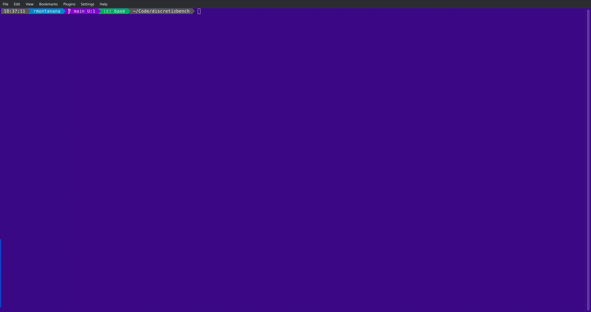
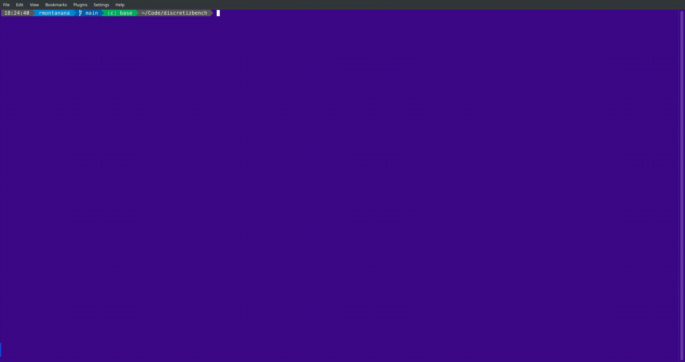

#  Platform


[](<https://opensource.org/licenses/MIT>)


Platform to run Bayesian Networks and Machine Learning Classifiers experiments.

## 0. Setup

Before compiling Platform.

### Miniconda

To be able to run Python Classifiers such as STree, ODTE, SVC, etc. it is needed to install Miniconda. To do so, download the installer from [Miniconda](https://docs.conda.io/en/latest/miniconda.html) and run it. It is recommended to install it in the home folder.

In Linux sometimes the library libstdc++ is mistaken from the miniconda installation and produces the next message when running the b_xxxx executables:

```bash
libstdc++.so.6: version `GLIBCXX_3.4.32' not found (required by b_xxxx)
```

The solution is to erase the libstdc++ library from the miniconda installation:

### MPI

In Linux just install openmpi & openmpi-devel packages. Only if cmake can't find openmpi installation (like in Oracle Linux) set the following variable:

```bash
export MPI_HOME="/usr/lib64/openmpi"
```

In Mac OS X, install mpich with brew and if cmake doesn't find it, edit mpicxx wrapper to remove the ",-commons,use_dylibs" from final_ldflags

```bash
vi /opt/homebrew/bin/mpicx
```

### boost library

[Getting Started](<https://www.boost.org/doc/libs/1_83_0/more/getting_started/index.html>)

The best option is install the packages that the Linux distribution have in its repository. If this is the case:

```bash
sudo dnf install boost-devel
```

If this is not possible and the compressed packaged is installed, the following environment variable has to be set pointing to the folder where it was unzipped to:

```bash
export BOOST_ROOT=/path/to/library/
```

In some cases, it is needed to build the library, to do so:

```bash
cd /path/to/library
mkdir own
./bootstrap.sh --prefix=/path/to/library/own
./b2 install
export BOOST_ROOT=/path/to/library/own/
```

Don't forget to add the export BOOST_ROOT statement to .bashrc or wherever it is meant to be.

### libxlswriter

```bash
cd lib/libxlsxwriter
make
make install DESTDIR=/home/rmontanana/Code PREFIX=
```

### Release

```bash
make release
```

### Debug & Tests

```bash
make debug
```

### Configuration

The configuration file is named .env and it should be located in the folder where the experiments should be run. In the root folder of the project there is a file named .env.example that can be used as a template.

## 1. Commands

### b_list

List all the datasets and its properties. The datasets are located in the _datasets_ folder under the experiments root folder. A special file called all.txt with the names of the datasets has to be created. This all file is built wih lines of the form:
<name>,<class_name>,<real_features>

where <real_features> can be either the word _all_ or a list of numbers separated by commas, i.e. [0,3,6,7]

### b_grid

Run a grid search over the parameters of the classifiers. The parameters are defined in the file _grid.txt_ located in the grid folder of the experiments. The file has to be created with the following format:

```json
{
    "all": [
        <set of hyperparams>, ...
    ],
    "<dataset_name>": [
        <specific set of hyperparams for <dataset_name>>, ...
    ],
}
```

The file has to be named _grid_<model_name>_input.json_

As a result it builds a file named _grid_<model_name>_output.json_ with the results of the grid search.

The computation is done in parallel using MPI.



### b_main

Run the main experiment. There are several hyperparameters that can set in command line:

- -d, -\-dataset <dataset_name> : Name of the dataset to run the experiment with. If no dataset is specificied the experiment will run with all the datasets in the all.txt file.
- -m, -\-model <classifier_name> : Name of the classifier to run the experiment with (i.e. BoostAODE, TAN, Odte, etc.).
- -\-discretize: Discretize the dataset before running the experiment.
- -\-stratified: Use stratified cross validation.
- -\-folds <folds>: Number of folds for cross validation (optional, default value is in .env file).
- -s, -\-seeds <seed>: Seeds for the random number generator (optional, default values are in .env file).
- -\-no-train-score: Do not calculate the train score (optional), this is useful when the dataset is big and the training score is not needed.
- -\-hyperparameters <hyperparameters>: Hyperparameters for the experiment in json format.
- -\-hyper-file <hyperparameters_file>: File with the hyperparameters for the experiment in json format. This file uses the output format of the b_grid command.
- -\-title <title_text>: Title of the experiment (optional if only one dataset is specificied).
- -\-quiet: Don't display detailed progress and result of the experiment.

### b_manage

Manage the results of the experiments.

### b_best

Get and optionally compare the best results of the experiments. The results can be stored in an MS Excel file.


