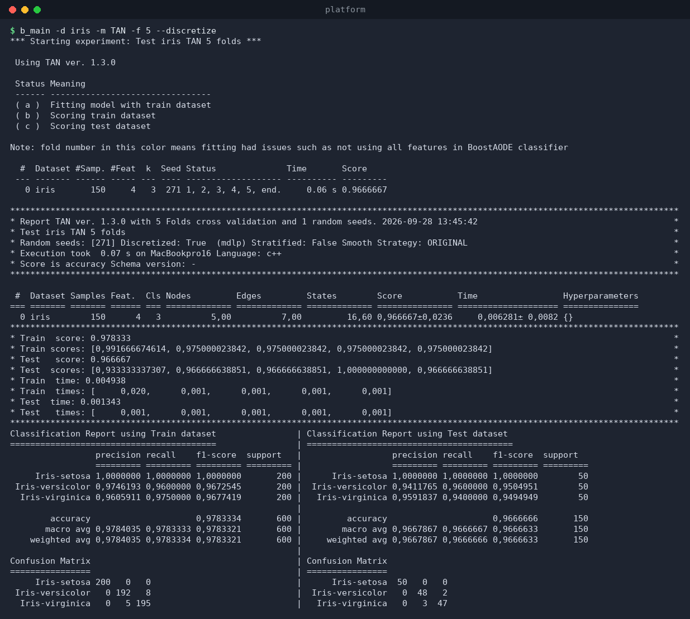

# Platform — User Manual

**Platform** is a C++ machine-learning framework for running and comparing
experiments with **Bayesian Networks** and other classifiers. It provides a
unified, command-line driven workflow: load datasets, run cross-validated
experiments (optionally in parallel with MPI), search hyperparameters, and
analyze and report the results (console, Excel, TeX/Markdown).

> **Version:** see `b_main --version` (the build reports the classifier
> libraries it links against, e.g. `BayesNet: 1.3.0`).
> **License:** MIT.

This manual is split into one file per topic. The terminal output shown below
was produced by actually running the commands against a real experiments
folder, so the numbers and layout match what you will see.

---

## Contents

| # | File | What it covers |
|---|------|----------------|
| 1 | [installation.md](installation.md) | Prerequisites, building, installing, testing |
| 2 | [configuration.md](configuration.md) | The `.env` file, datasets folder, project layout |
| 3 | [b_main.md](b_main.md) | Run a classification experiment |
| 4 | [b_grid.md](b_grid.md) | Hyperparameter grid search (MPI) |
| 5 | [b_best.md](b_best.md) | Best results, comparisons, Friedman test |
| 6 | [b_list.md](b_list.md) | List datasets and results |
| 7 | [b_manage.md](b_manage.md) | Interactive results manager (terminal UI) |
| 8 | [b_results.md](b_results.md) | Validate and fix result files |
| 9 | [classifiers.md](classifiers.md) | Available models and their hyperparameters |
| 10 | [results-format.md](results-format.md) | Result file naming and JSON schema |
| 11 | [troubleshooting.md](troubleshooting.md) | Common errors and how to fix them |

Screenshots live in the [`screenshots/`](screenshots/) folder.

---

## The six commands

Platform ships six executable files, all built from `src/commands/`:

| Command | Purpose |
|---------|---------|
| `b_main`    | Run the main experiment (cross-validated classification). |
| `b_grid`    | Grid search over hyperparameters, in parallel with MPI. |
| `b_best`    | Get and compare the best results; Friedman test; Excel/TeX export. |
| `b_list`    | List available datasets, or the results of a dataset. |
| `b_manage`  | Interactive terminal UI to browse, filter, compare and manage results. |
| `b_results` | Validate (and fix) the result JSON files against the schema. |

A typical workflow looks like this:

```
b_list datasets      →  see what data you have
b_main               →  run experiments, save results
b_grid search        →  tune hyperparameters (optional)
b_grid experiment    →  re-run with the best hyperparameters
b_best               →  compare everything, run statistics
b_manage             →  browse and clean up results
b_results            →  make sure the result files are valid
```

---

## Where results are stored

All commands read their configuration from a `.env` file in the **current
working directory** and read/write the standard folders relative to it. A
typical experiments directory therefore looks like:

```
my_experiment/
├── .env                 # configuration (required)
├── datasets/            # your ARFF files + all.txt
│   ├── all.txt
│   └── iris.arff
├── results/             # result_*.json, best_results_*.json
├── grid/                # grid_<model>_input.json / _output.json
├── graphs/              # Graphviz .dot files (--graph)
├── excel/               # exported .xlsx files
├── tex/                 # exported .tex / .md files
└── hidden_results/      # intermediate per-fold results
```

See [configuration.md](configuration.md) for the full layout and the meaning
of every `.env` key.

---

## Quick start

```bash
# 1. Build (once)
make init            # install dependencies with Conan
make debug           # build (or: make release)

# 2. Prepare an experiments folder with .env and datasets/ (see configuration.md)
cd my_experiment

# 3. See your datasets
b_list datasets

# 4. Run an experiment on iris with the TAN classifier, 5 folds
b_main -d iris -m TAN -f 5

# 5. Look at the best results
b_best -m TAN -s accuracy
```

A sample experiment with discretization produces output like this:



Full details: [b_main.md](b_main.md).

---

## Conventions used in this manual

* `$ b_main ...` — a command you type in your shell, followed by a screenshot
  of the real output.
* `> ` blocks — literal file contents (e.g. `.env`, `all.txt`, JSON).
* *italics* — a value you replace with your own (dataset name, model name, …).
