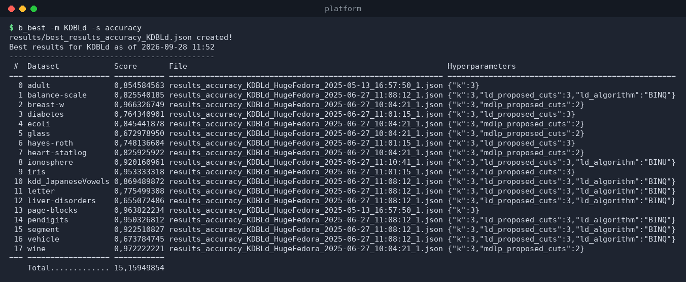
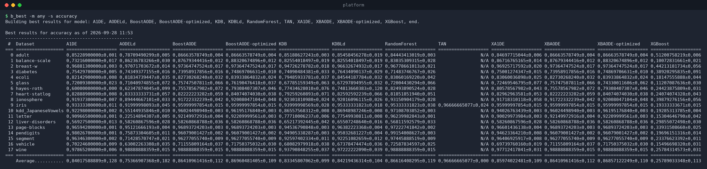
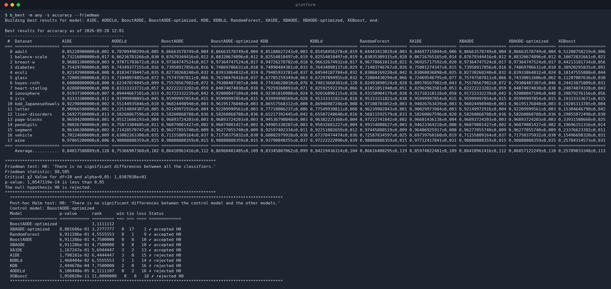

# `b_best` — best results and comparisons

`b_best` reads every `results/results_*.json` file in the results folder,
selects, **for each dataset, the run with the highest score**, and reports
it. It can work for a single model or for *all* models at once (building a
comparison table), and it can run the **Friedman test** with a post-hoc
comparison, and export to Excel / TeX / Markdown.

```
b_best [options]
```

## Options

| Option | Description |
|--------|-------------|
| `-m, --model <name>` | Model to report, or `any` for all models (default `any`). |
| `-d, --dataset <name>` | Restrict to one dataset, or `any` (default `any`). |
| `-s, --score <name>` | Score to rank by: `accuracy` or `roc-auc-ovr` (default from `.env`). |
| `--folder <path>` | Results folder (default `results/`). |
| `--friedman` | Run the Friedman test + post-hoc test. **Only valid with `-m any -d any`**, and requires at least 3 models and 3 datasets, each model having results for every dataset. |
| `--level <α>` | Significance level for the tests, in `[0.01, 0.15]` (default `0.05`). |
| `--excel` | Export to Excel (creates an `.xlsx` in `excel/` and opens it). |
| `--tex` | Write `tex/results.tex` and `tex/results.md` (and, with `--friedman`, `tex/post_hoc.tex` / `post_hoc.md`). |
| `--index` | With `--tex`: show dataset **indices** instead of names to save space. |

## Single model

```bash
$ b_best -m KDBLd -s accuracy
```

This (re)builds `results/best_results_accuracy_KDBLd.json` and prints the
per-dataset best run:



Each line shows the dataset, the best score, the **result file** it came
from, and the hyperparameters used. The `best_results_*.json` file is what
`b_main --hyper-best` and `b_grid experiment --hyper-best` consume.

## All models (comparison table)

```bash
$ b_best -m any -s accuracy
```

Prints one column per model and one row per dataset; cells contain the best
score ± standard deviation over seeds, or `N/A` when that model has no
result for the dataset. The last row is the per-model average (the best
model is highlighted).



## Friedman test and post-hoc comparison

```bash
$ b_best -m any -s accuracy --friedman
```

On top of the comparison table, this computes:

* **Friedman test** — H0: *there is no significant difference between all
  the classifiers*. Reports the Friedman statistic, the critical χ² value
  for `df = n_models − 1`, and the p-value, and states whether H0 is
  rejected.
* **Post-hoc test** — compares every model against the **control model**
  (the one with the best average rank). For `accuracy` the **Holm**
  procedure is used; for `roc-auc-ovr` the **Wilcoxon** test. Each model gets
  a p-value, its average rank, win/tie/loss counts, and an
  *accepted/rejected H0* verdict.



With `--tex --index` the same information is written to
`tex/results.tex`, `tex/results.md`, `tex/post_hoc.tex` and
`tex/post_hoc.md` for use in papers.

## Excel export

```bash
b_best -m any -s accuracy --excel
```

Builds `excel/BestResults_accuracy.xlsx` (with the Friedman statistics when
`--friedman` is set) and opens it with the default application.

## Requirements and limits

* The Friedman test needs **complete data**: every model must have a result
  for every dataset (≥ 3 models, ≥ 3 datasets). If a model is missing for
  some dataset, the test aborts with a `key '<dataset>' not found` error —
  either run that model on the missing datasets or exclude the model.
* `--friedman` can only be used with all models and all datasets
  (`-m any -d any`); combining it with a filter exits with an error.
