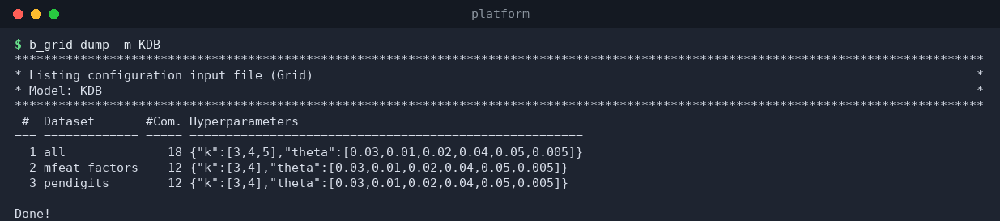
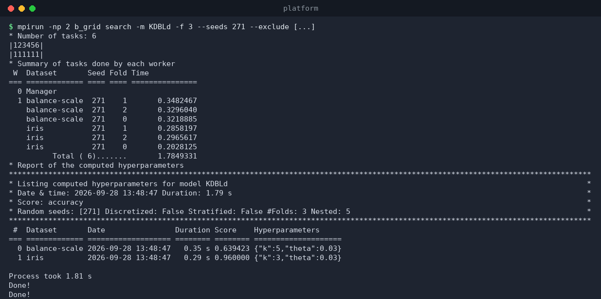
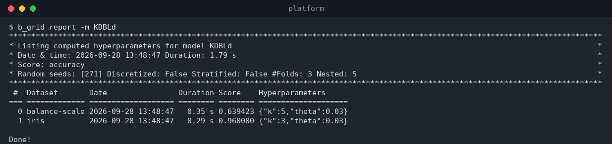
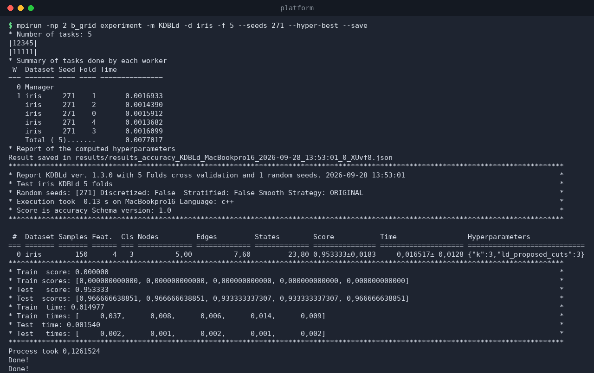

# `b_grid` — hyperparameter grid search

`b_grid` searches a model's hyperparameter space and runs experiments with
the best settings. The heavy lifting is done **in parallel with MPI**: the
work is split into tasks (dataset × seed × fold) that are distributed across
MPI ranks, and the manager process (rank 0) collects and reports the results.

It has four subcommands:

```
b_grid dump       -m <model>                 show the combinations to be tested
b_grid search     -m <model> [options]       run the grid search (needs mpirun)
b_grid report     -m <model>                 show previously computed results
b_grid experiment -m <model> [b_main opts]   run b_main-like experiments in parallel
```



## 1. The input file

The search space is defined in `grid/grid_<model>_input.json`:

```json
{
  "all": [
    { "k": [3, 5], "theta": [0.01, 0.03] }
  ],
  "iris": [
    { "k": [3, 5, 7], "theta": [0.01, 0.03, 0.05] }
  ]
}
```

* Each **key** is a dataset name, or the special key `"all"`.
* Each **value** is a list of *lines*; each line is a JSON object mapping a
  hyperparameter to a **list of candidate values**.
* All candidate combinations (the Cartesian product of the lists in a line)
  are tested. A dataset that has its own key uses only its lines; otherwise
  it falls back to `"all"`.
* The number of combinations per dataset is shown by `b_grid dump`.

## 2. `b_grid dump`

Prints the configuration file: dataset, number of combinations, and the
hyperparameter lines.

```bash
$ b_grid dump -m KDB
```


## 3. `b_grid search`

Runs the actual search. Because it is MPI-parallel it **must** be launched
with `mpirun` and **at least 2 processes**:

```bash
mpirun -np 4 b_grid search -m <model> [options]
```

| Option | Description |
|--------|-------------|
| `-m, --model <name>` | Model to tune (required). |
| `--score <name>` | Metric used to rank combinations (default `accuracy`). |
| `-f, --folds <k>` | Outer cross-validation folds (≥ 2). |
| `-s, --seeds <…>` | Random seeds (up to 10; `-1` = pseudo-random). |
| `--discretize` | Discretize inputs (default from `.env`). |
| `--stratified` | Stratified k-fold (default from `.env`). |
| `--smooth-strat <s>` | Smoothing strategy: `ORIGINAL`, `LAPLACE`, `CESTNIK`. |
| `--nested <k>` | Number of inner folds for **nested** cross-validation (≥ 2; default 5). Each combination is evaluated with nested CV to avoid optimistic bias. |
| `--exclude '["a", "b"]'` | JSON list of datasets to skip. |
| `--continue <dataset>` | Resume a previous run, starting *after* this dataset (previous `grid_<model>_output.json` is loaded). |
| `--only` | With `--continue`: search **only** that dataset. |
| `--quiet` | Less progress output. |

A search over two small datasets with 3 folds:

```bash
$ mpirun -np 2 b_grid search -m KDBLd -f 3 --seeds 271 \
    --exclude '["adult","breast-w","diabetes","ecoli","glass","hayes-roth",\
"heart-statlog","ionosphere","kdd_JapaneseVowels","letter","liver-disorders",\
"page-blocks","pendigits","segment","vehicle","wine"]'
```



Output walkthrough:

* `Number of tasks` — tasks are `datasets × seeds × folds`; the `|123456|`
  bars show how they were distributed across workers.
* **Summary of tasks done by each worker** — per-worker dataset/seed/fold
  and time.
* **Report of the computed hyperparameters** — for each dataset: date,
  duration, best score, and the **winning hyperparameters**.

Results are written to `grid/grid_<model>_output.json`:

```json
{
  "model": "KDBLd",
  "score": "accuracy",
  "discretize": false,
  "stratified": false,
  "n_folds": 3,
  "seeds": [271],
  "date": "2026-09-28 13:48:47",
  "nested": 5,
  "platform": "MacBookpro16",
  "duration": "1.79 s",
  "results": {
    "balance-scale": { "score": 0.6394, "hyperparameters": {"k": 5, "theta": 0.03}, … },
    "iris":          { "score": 0.96,   "hyperparameters": {"k": 3, "theta": 0.03}, … }
  }
}
```

## 4. `b_grid report`

Re-prints the report from a previous run's output file — no computation:

```bash
$ b_grid report -m KDBLd
```



## 5. `b_grid experiment`

Runs `b_main`-style experiments **in parallel with MPI**, using the
hyperparameters you choose (or the best ones found so far). It accepts the
same options as `b_main` (dataset, folds, seeds, score, discretize,
stratified, hyperparameters/hyper-file/hyper-best, save, …):

```bash
mpirun -np 2 b_grid experiment -m KDBLd -d iris -f 5 --seeds 271 --hyper-best --save
```



Each task is a dataset × seed (one per fold internally), and the manager
prints the usual experiment report and saves the result with `--save`.

## Typical tuning workflow

```
1. b_grid dump      -m M          # sanity-check the search space
2. mpirun -np N b_grid search -m M
3. b_grid report    -m M          # inspect winners
4. b_main -d D -m M --hyper-best  # (or b_grid experiment) run with the winners
5. b_best -m M                        # record the best results
```
