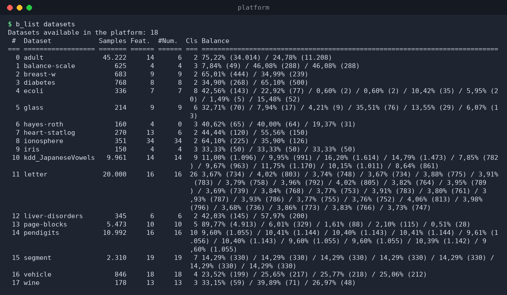
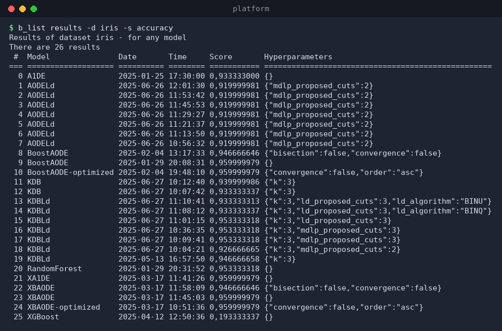

# `b_list` — list datasets and results

`b_list` has two subcommands:

```
b_list datasets [--excel]
b_list results -d <dataset> [-m <model>] [-s <score>] [--excel]
```

## `b_list datasets`

Lists every dataset declared in `datasets/all.txt`, with its size, feature
counts, number of classes and the class balance distribution.

```bash
$ b_list datasets
```



Columns:

| Column | Meaning |
|--------|---------|
| `#` | Index (used by other commands when a dataset is ambiguous). |
| `Dataset` | Dataset name. |
| `Samples` | Number of rows. |
| `Feat.` | Total number of features. |
| `#Num.` | Number of numeric (continuous) features. |
| `Cls` | Number of classes. |
| `Balance` | Percentage (and count) of samples per class. |

Add `--excel` to write `excel/datasets.xlsx` and open it.

## `b_list results`

Lists the saved results for a given dataset, from the `results/` folder.

```
-d, --dataset <name>   (required) dataset to look up
-m, --model <name>     model filter; use `any` for all (default `any`)
-s, --score <name>     score filter (default `accuracy`)
--excel                also write excel/results.xlsx and open it
```

Example — every saved result for `iris`, any model:

```bash
$ b_list results -d iris -s accuracy
```



Each row is one saved result file: model, date, time, score, and the
hyperparameters used. Filtering by model:

```bash
$ b_list results -d iris -m TAN -s accuracy
```

If nothing matches you get a clear message instead of a table:

```
No results found for dataset iris and model TAN
```

## Notes

* `b_list` never modifies your data; it only reads `datasets/` and
  `results/`.
* The dataset and model names are validated against `all.txt` and the
  registered models, so typos are reported with the list of valid values.
