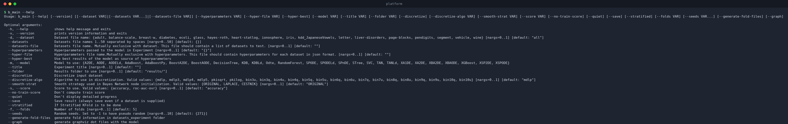
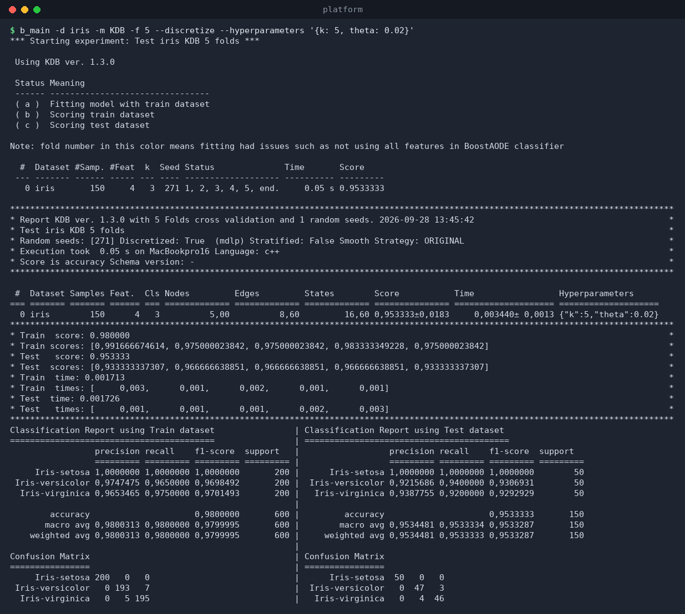
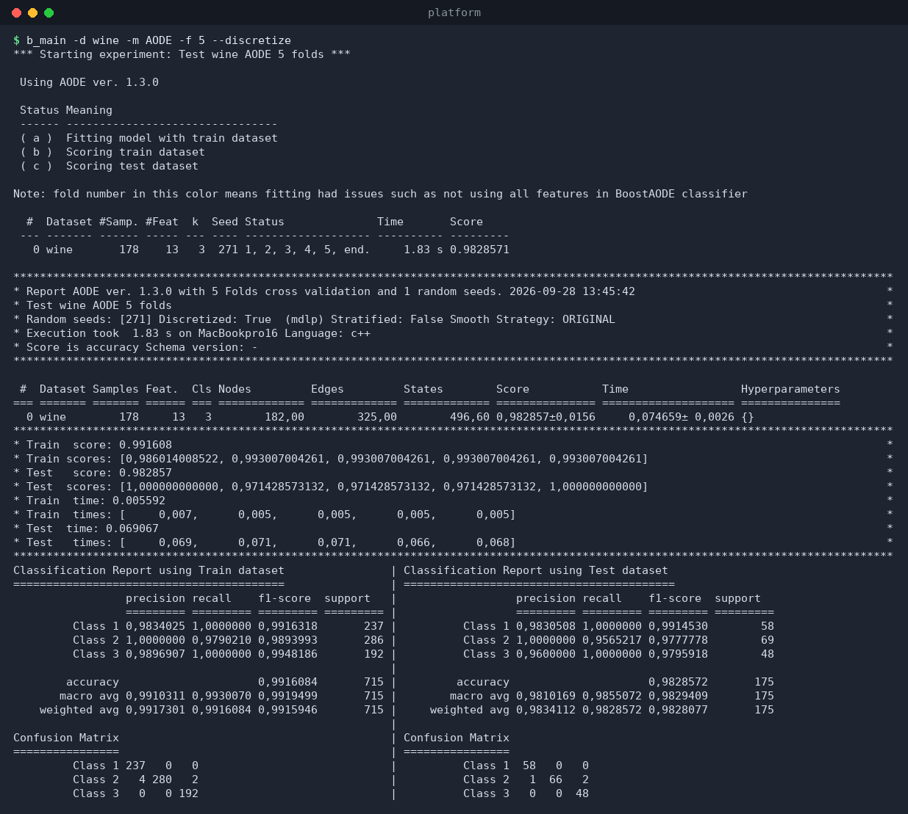
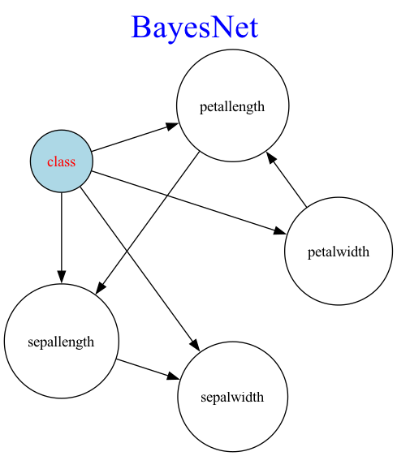

# `b_main` — run an experiment

`b_main` is the main experiment runner. It loads one or more datasets,
trains a classifier with **k-fold cross-validation** (optionally stratified,
optionally discretized), evaluates it, prints a report, and optionally saves
the results.

```
b_main [options]
```

Run `b_main --help` to see the full option list (it includes your dataset
and model names, read from the current folder):



## Options

### Datasets (mutually exclusive)

| Option | Description |
|--------|-------------|
| `-d, --dataset <name>` | Run on a single dataset. Default: `all` (every dataset in `all.txt`). |
| `--datasets <n1> <n2> …` | Run on 1–50 datasets given as a space-separated list. |
| `--datasets-file <file>` | Read the dataset list from a file (one name per line; `#` comments allowed). |

> Using `--datasets`, `--datasets-file`, or `all` **always saves** the
> results. For a single `-d` dataset you must add `--save` to persist them.

### Model and hyperparameters

| Option | Description |
|--------|-------------|
| `-m, --model <name>` | Classifier to use. One of the registered models (see [classifiers.md](classifiers.md)). |
| `--hyperparameters '<json>'` | Hyperparameters for the model, as a JSON object, e.g. `'{"k": 5, "theta": 0.02}'`. |
| `--hyper-file <file>` | Hyperparameters per dataset, from a JSON file (uses the **output** format of `b_grid search`). Mutually exclusive with `--hyperparameters`. |
| `--hyper-best` | Use the per-dataset best hyperparameters from `results/best_results_<score>_<model>.json` (created by `b_best`). |

### Evaluation

| Option | Description |
|--------|-------------|
| `-f, --folds <k>` | Number of cross-validation folds (≥ 2). Default: `n_folds` from `.env`. |
| `--stratified` | Use stratified k-fold cross-validation (default from `.env`). |
| `-s, --score <name>` | Metric to compute and rank: `accuracy` or `roc-auc-ovr` (default from `.env`). |
| `--no-train-score` | Skip computing the train score (useful on big datasets). |
| `--seeds <s1> … <s10>` | Up to 10 random seeds. Use `-1` for a pseudo-random seed. Default: `seeds` from `.env`. |

### Preprocessing

| Option | Description |
|--------|-------------|
| `--discretize` | Discretize the dataset before training (default from `.env`). |
| `--discretize-algo <algo>` | Discretization algorithm: `mdlp`, `mdlp3…5`, `pkisqrt`, `pkilog`, `bin3u…bin10q/u` (default from `.env`). |
| `--smooth-strat <strat>` | Bayes-network smoothing strategy: `ORIGINAL`, `LAPLACE`, `CESTNIK` (default from `.env`). |

### Output and bookkeeping

| Option | Description |
|--------|-------------|
| `--title <text>` | Experiment title. **Mandatory** when testing all datasets. Auto-generated otherwise (e.g. `Test iris TAN 5 folds`). |
| `--folder <path>` | Results folder (default `results/`). |
| `--save` | Save the result JSON (always saved when running more than one dataset). |
| `--quiet` | Don't display the detailed progress and the final report. |
| `--generate-fold-files` | Write the train/test fold data to `datasets_experiment/` (see [results-format.md](results-format.md)). |
| `--graph` | Save Graphviz `.dot` files of the learned network, one per dataset and fold, to `graphs/`. **Requires `--save`** (the file name of the result is used as a prefix). |

## Examples

### Single dataset, default settings

```bash
$ b_main -d iris -m TAN -f 5 --discretize
```


The output has three parts:

1. **Progress header** — experiment title, model version, and a live table
   of folds as they finish. The per-fold `Status` column uses
   `a`/`b`/`c` for *fitting / scoring train / scoring test*; a fold number
   printed in yellow means the fit had issues (e.g. a feature was dropped in
   BoostAODE).
2. **Report box** — one line per dataset with sample/feature/class counts,
   structure statistics (`Nodes`, `Edges`, `States` — headers configurable in
   `.env`), mean ± std score, time, and the hyperparameters used. Below it,
   the per-fold train/test scores and times.
3. **Classification report + confusion matrix** (single dataset only) —
   precision/recall/F1 per class for train and test, plus both confusion
   matrices side by side.

### With hyperparameters

```bash
$ b_main -d iris -m KDB -f 5 --discretize --hyperparameters '{"k": 5, "theta": 0.02}'
```



### Another model, another dataset

```bash
$ b_main -d wine -m AODE -f 5 --discretize
```



### Multiple datasets

```bash
# two or more datasets on the command line
b_main --datasets iris wine ecoli -m TAN --discretize

# from a file (one dataset per line)
b_main --datasets-file small.txt -m TAN --discretize
```

Both forms save the results automatically and get an auto-generated title
such as `Test 3 datasets TAN 5 folds` unless you pass `--title`.

### All datasets

```bash
b_main -m TAN --discretize --title "TAN on all datasets, MDLP"
```

### Save, graph, and fold files

```bash
# persist the result and export the learned network as .dot files
b_main -d iris -m TAN -f 5 --discretize --save --graph

# also dump the exact train/test splits used (reproducibility)
b_main -d iris -m TAN -f 5 --discretize --generate-fold-files
```

The learned network for fold 1 of the iris/TAN run above looks like this
(rendered with Graphviz from the generated `.dot`):



Render any saved graph yourself with:

```bash
dot -Tpng graphs/results_…_graph_iris_1.dot -o tan.png
```

### Using the best hyperparameters found by grid search

```bash
# first: b_best -m KDBLd   (creates best_results_accuracy_KDBLd.json)
b_main -d iris -m KDBLd -f 5 --hyper-best --save
```

## Notes

* **Discrete vs continuous models.** Some classifiers need integer-valued
  input (e.g. `TAN`), others need floating-point input (e.g. `KDBLd`). If a
  model complains about the tensor type, try toggling `--discretize` — see
  [troubleshooting.md](troubleshooting.md).
* **Quiet mode** (`--quiet`) still saves results when `--save` (or
  multi-dataset mode) is active; it only suppresses the console output.
* Results are written to `results/results_<score>_<model>_<platform>_<date>_<time>_<n>_<rand>.json`
  — see [results-format.md](results-format.md).
