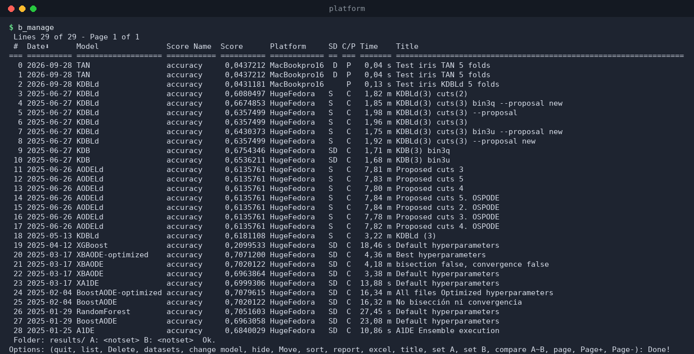
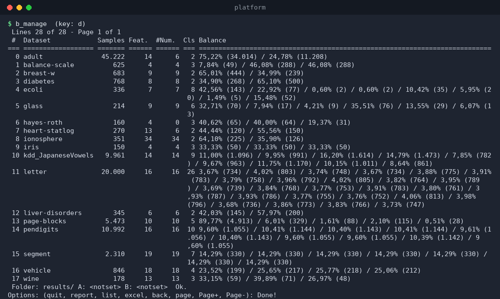
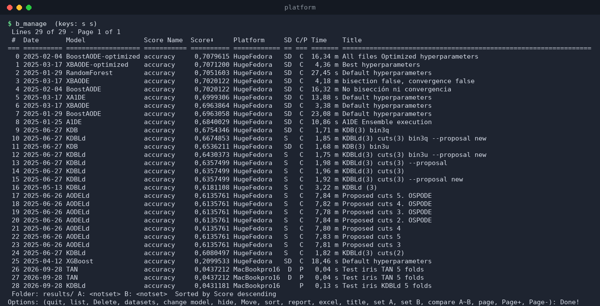
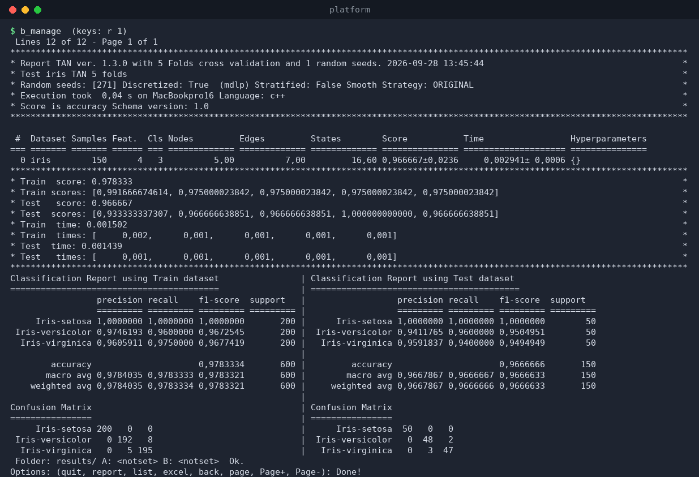

# `b_manage` — interactive results manager

`b_manage` is a full-screen **terminal user interface** for browsing,
filtering, comparing, and managing the result files in a results folder.
It is the fastest way to survey many experiments, export a subset to Excel,
compare two experiments, or move/hide/delete result files.

```
b_manage [options]
```

## Options

| Option | Description |
|--------|-------------|
| `-m, --model <name>` | Show only results of this model (default `any`). |
| `-s, --score <name>` | Show only results of this score (default `any`). |
| `--platform <name>` | Show only results from this platform (default `any`). |
| `--folder <path>` | Results folder (default `results/`). |
| `--complete` | Show only **complete** results (all datasets present). |
| `--partial` | Show only **partial** results. |
| `--compare` | Open in compare mode (set A/B and compare two experiments). |

## The main screen

On start you see a paginated table of every result file in the folder:



| Column | Meaning |
|--------|---------|
| `#` | Row index (used as the value for most commands). |
| `Date` | Result date (the current sort column shows an arrow: `Date⬇`). |
| `Model` | Classifier name. |
| `Score Name` | Metric (`accuracy`, `roc-auc-ovr`). |
| `Score` | Best score of the result. |
| `Platform` | Machine that produced it. |
| `SD` | Flags: **S** = stratified, **D** = discretized. |
| `C/P` | **C** = complete (all datasets), **P** = partial. |
| `Time` | Duration (auto-scaled to s / m / h). |
| `Title` | Experiment title. |

Rows with validation problems are drawn in red; the top-right header shows
the linked library versions (`BayesNet: x.y.z Folding: z… MDLP: …`).

The footer shows the current folder, the A/B comparison selections, the last
status message, and the **Options** line with the available keys.

## Commands

Type a single key (plus a row number when needed), then press **Enter**.

| Key | Action |
|-----|--------|
| `q` | Quit (exports Excel first if you requested it). |
| `l` | Back to the main list (from datasets/detail views). |
| `d` | Show the **datasets** view (samples/features/classes/balance, like `b_list datasets`). |
| `r <#>` | Show the **detail** of result `#`: per-dataset table, per-fold scores, classification reports, confusion matrices. |
| `e <#>` | Export result `#` to Excel. |
| `s` | **Sort** the list — you are then asked for the field: `d` date, `s` score, `t` duration, `m` model, `i` title — and the direction: `+` ascending, `-` descending. |
| `m <#>` | Change the model of result `#` (interactive prompt). |
| `t <#>` | Change the title of result `#`. |
| `h <#>` | **Hide** result `#` (moved out of `results/` into `hidden_results/`). |
| `M <#>` | **Move** result `#` to another folder. |
| `D <#>` | **Delete** result `#` (asks for confirmation). |
| `A <#>` / `B <#>` | Set comparison slot A / B. |
| `c` | **Compare** A~B (side-by-side report; Excel export of the comparison). |
| `p <n>` | Go to page *n*. |
| `+` / `-` | Next / previous page. |

### Datasets view

```
key: d
```



### Sorting by score

```
keys: s  then  s
```



### Result detail

```
keys: r 1        # detail of row 1
```

Shows the full report of the selected result: per-dataset scores with
hyperparameters, per-fold train/test scores and times, and the
classification report + confusion matrices.



## Tips

* The terminal must be wide enough for the columns; otherwise
  `b_manage` tells you how many extra columns are needed and exits — make
  the window bigger and re-run.
* Filtering on the command line (`-m`, `-s`, `--platform`, `--complete`,
  `--partial`) is the easiest way to focus the list before you start
  navigating.
* Every destructive action (`D`, `h`, `M`, `e`) asks for confirmation with
  the affected file name.
