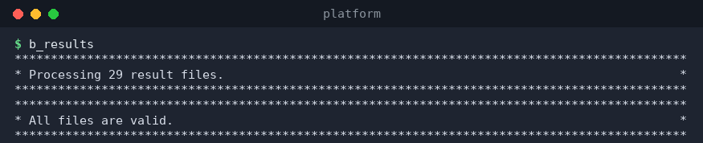

# `b_results` — validate and fix result files

`b_results` checks the result JSON files in the results folder against the
**schema 1.0** (a JSON Schema, see [results-format.md](results-format.md))
and can repair simple inconsistencies in place.

```
b_results [--fix] [--file <name>]
```

| Option | Description |
|--------|-------------|
| `--fix` | Fix any errors found (rewrites the affected files). |
| `--file <name>` | Validate a single file (relative to `results/`, or an absolute path inside it). |

## Validate everything

```bash
$ b_results
```

```
*********************************************************************
* Processing 29 result files.                                       *
*********************************************************************
*********************************************************************
* All files are valid.                                              *
*********************************************************************
```



If a file has problems, each error is listed below the file name:

```
results/results_accuracy_Foo_….json: 2 Errors:
 - /results/0: required property 'score_std' missing
 - /results/3/scores_test: expected array of numbers
```

and the summary block says how many files had errors (and lists them).

## Validate one file

```bash
b_results --file results_accuracy_TAN_MacBookpro16_2026-09-28_13:45:44_0_4c4Ql.json
```

## Fixing errors

Re-run with `--fix` to let the validator repair what it can; each fixed
file is reported with `-> File fixed.`

```bash
b_results --fix
```

## Notes

* Only files named `results_*.json` in the results folder are considered.
* Validation is read-only unless you pass `--fix`; `b_results` never deletes
  files.
* Schema violations usually appear after editing result files by hand or
  after running an older version of Platform — fixing (or re-running the
  experiment) keeps `b_best` and `b_manage` working correctly.
